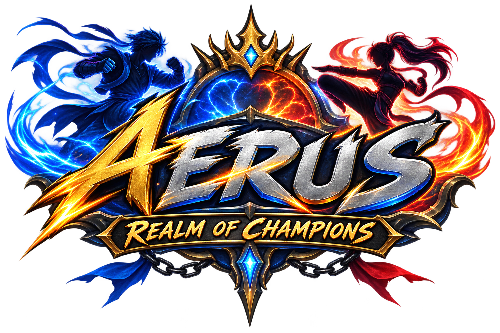

<div align="center">

  <!-- Main Game Logo -->
  

  # Aerus: Realm of Champions

  **A lightweight, cross-platform 2D web fighting game built with HTML5 Canvas and Vanilla JavaScript.**

  [](LICENSE)
  []()
  [](https://github.com/your-username/aerus-realm/pulls)

  [Play Live Demo](https://your-username.github.io/aerus-realm/) · [Report Bug](https://github.com/your-username/aerus-realm/issues) · [Request Feature](https://github.com/your-username/aerus-realm/issues)

</div>

---

## ⚔️ About the Game

**Aerus: Realm of Champions** is an open-source 2D fighting game designed to run natively inside any web browser without external game engines or heavy framework downloads. Built with raw JavaScript and standard HTML5 Canvas, it offers crisp, high-framerate combat, directional attack hitboxes, and a responsive UI tailored for both desktop keyboards and mobile touchscreens.

---

## ✨ Features

- 📱 **Mobile & Desktop Ready:** Features responsive on-screen touch joysticks and attack buttons for mobile devices, along with full keyboard bindings for desktop play.
- ⚡ **Zero Dependencies:** Pure vanilla JS and HTML5 canvas—fast loading times and zero build steps required.
- 🥊 **Real-Time Combat Engine:** Custom 2D physics, gravity, jumping, directional facing, and dynamic rectangle collision detection.
- 🎨 **Fully Moddable:** Clean, single-file game structure making it effortless to add custom character sprites, new abilities, or stage graphics.
- 📄 **100% Free & Open Source:** Licensed under the permissive **MIT License**.

---

## 🎮 How to Play & Controls

### 📱 Mobile Controls
* **Left / Right Arrows (◀ / ▶):** Move Champion
* **Jump Arrow (▲):** Jump
* **Attack Button (⚔):** Perform Attack

### 💻 Desktop Keyboard Controls

| Action | Player 1 (Aerus) | Player 2 (Rival) |
| :--- | :--- | :--- |
| **Move Left / Right** | `A` / `D` | `←` / `→` |
| **Jump** | `W` | `↑` |
| **Basic Attack** | `SPACE` | `ENTER` |

---

## 🛠️ Repository Structure

```text
aerus-realm/
├── index.html        # Main game application, UI, and Canvas engine
├── LICENSE           # MIT Open-Source License
├── README.md         # Project documentation and guide
└── image/
    └── mainlogo.png  # Main game logo & favicon asset
